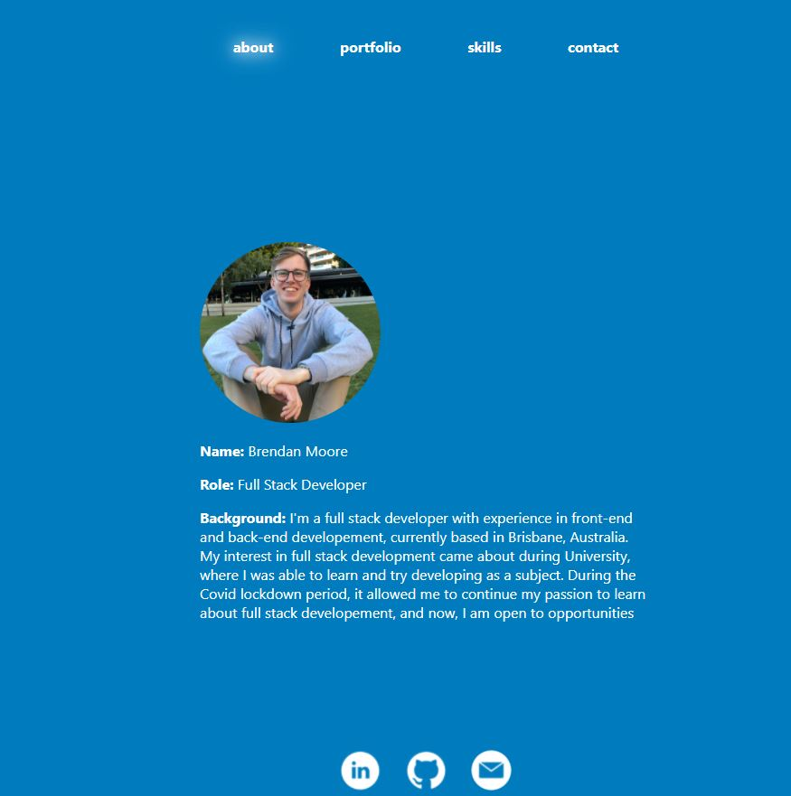
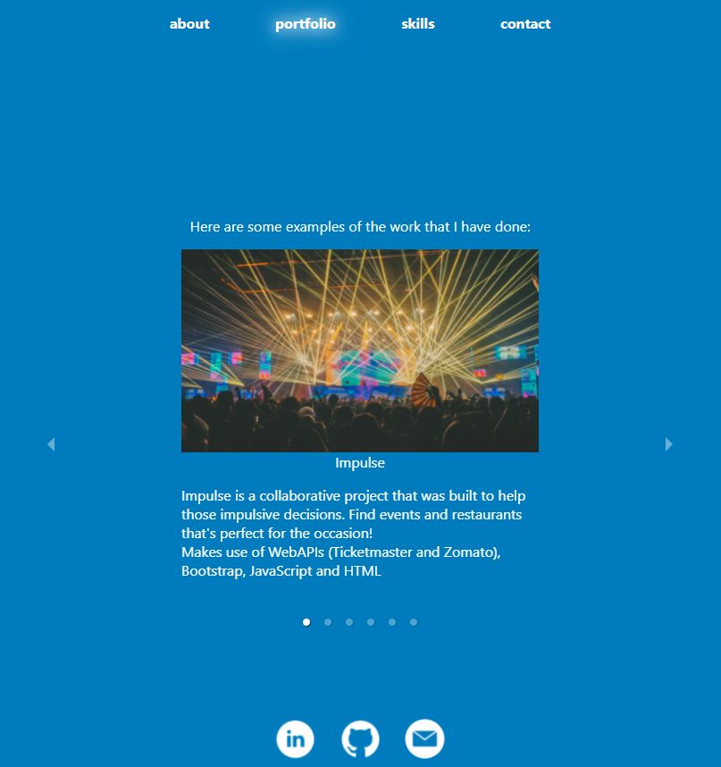
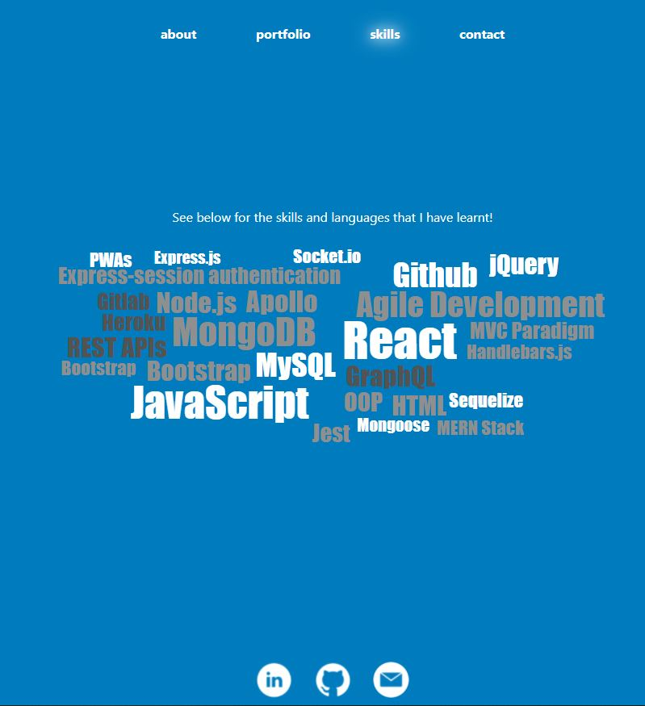
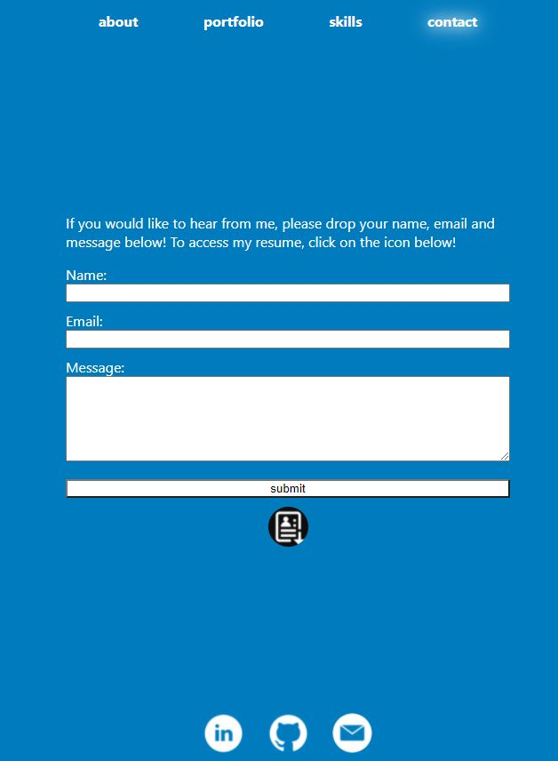

# React Portfolio

  [](https://opensource.org/licenses/MIT)

  ## Table of Contents
  - [Description](#description)
  - [Installation](#installation)
  - [Usage Information](#usage-information)
  - [License](#license)
  - [Contribution Guidelines](#contribution-guidelines)
  - [Test Procedure](#test-procedure)
  - [Questions](#questions)
  - [Images](#images)

  ## Description
  This project is a remake of my [Portfolio](https://bdjm94.github.io/brendan-portfolio/), but it has now been built using React. Now has a working Contact Form, built through the use of the npm package emailjs-com. Also uses a react carousel for the portfolio page and a react wordcloud for the skills page.

  Visit my [React Portfolio here](https://bdjm94.github.io/20-React-Portfolio/#/about)

  ## Installation
  ```
  - git clone 
  - npm i 
  - npm start
  ```

  ## Usage Information
  Use this to build a React Portfolio

  ## License
  MIT

  ## Contribution Guidelines
  Contribute freely

  ## Test Procedure
  n/a

  ## Questions
  If you have any questions, then feel free to contact me on the below:
  - Github: [bdjm94](https://github.com/bdjm94)
  - Email: [brendandjmoore@gmail.com](brendandjmoore@gmail.com)

  ## Images
| Home Page |
|------------|
  

| Portfolio Page |
|------------|
  

| Skills Page |
|------------|
  

| Contact Page |
|------------|
  
